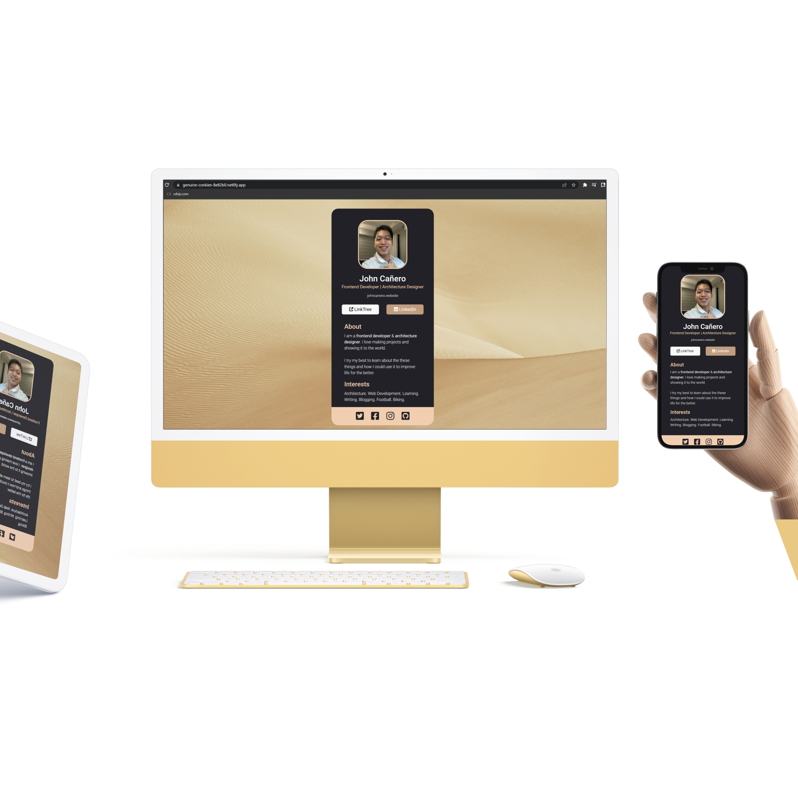
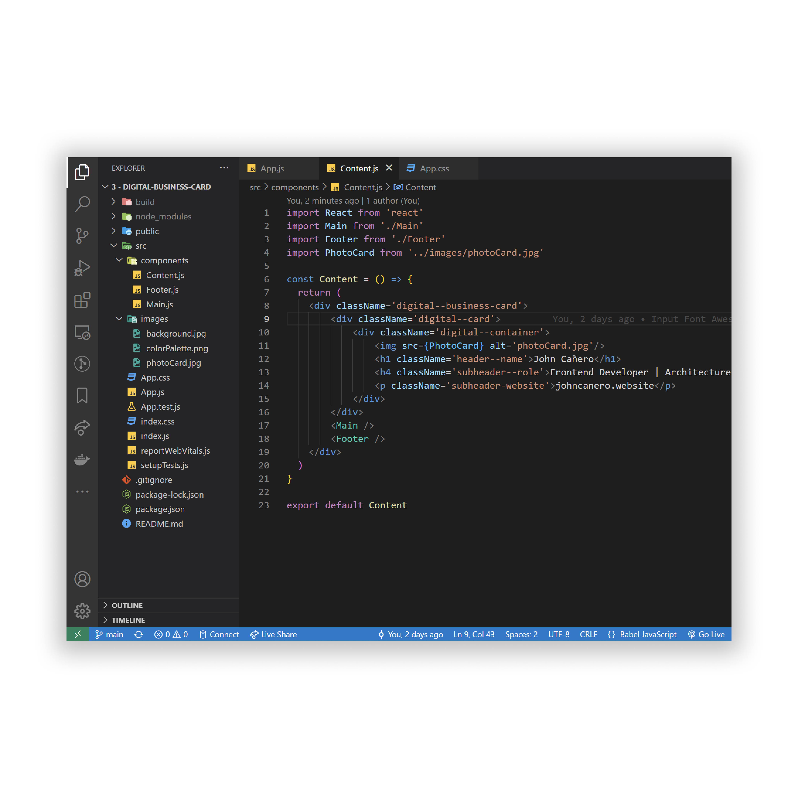
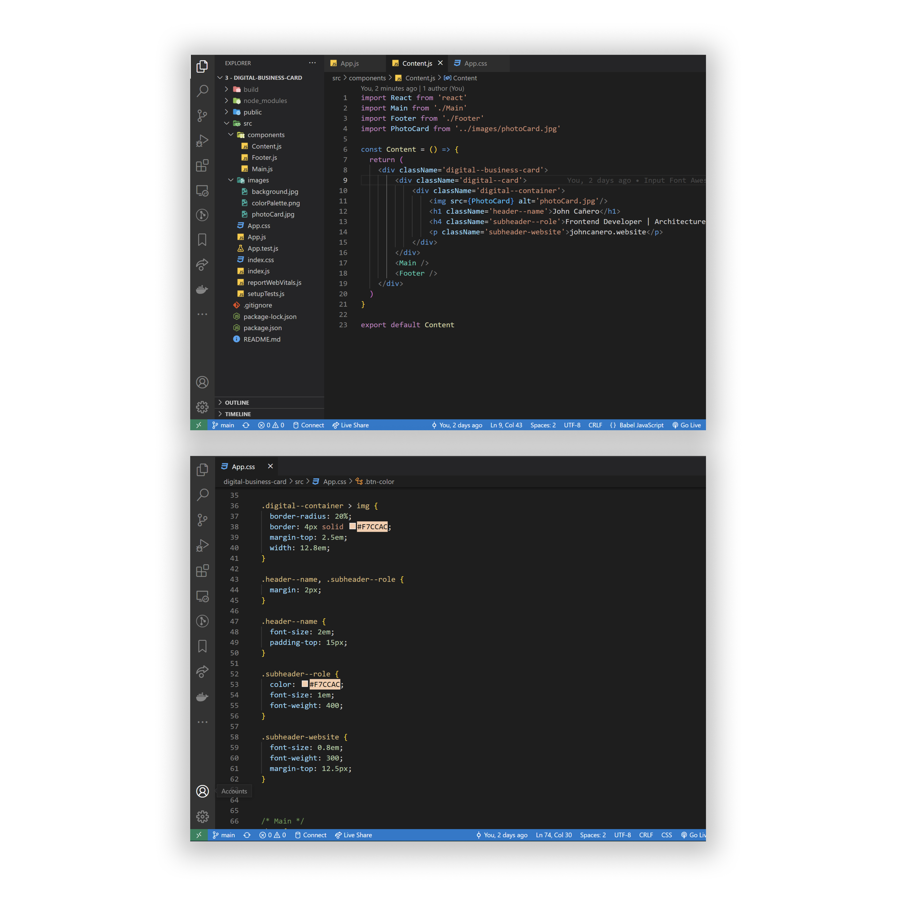

<!-- markdownlint-configure-file {
  "MD013": {
    "code_blocks": false,
    "tables": false
  },
  "MD033": false,
  "MD041": false
} -->

  

# Digital Business Card

This is a Digital Business Card Project. 📇 The card is made by React JS Code. 🔵
This is a Scrimba Challenge Project # 2 from the Ultimate React 101 Course.
It is definitely worth trying to take the challenge and seeing it unveil its work.

Digital Business Card: John Cañero

## Website

🖥️ [https://johncanero-card.vercel.app/]

✍️ Project by John Cañero

## Responsive Design

🪟: [Desktop - Tablet - Mobile]

